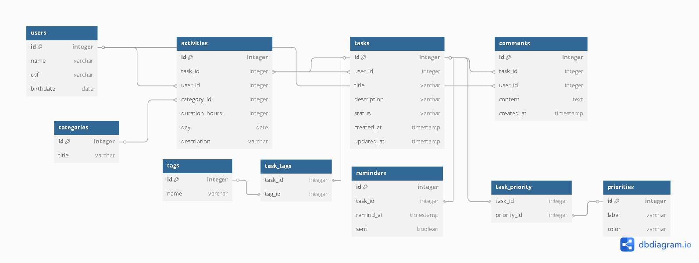
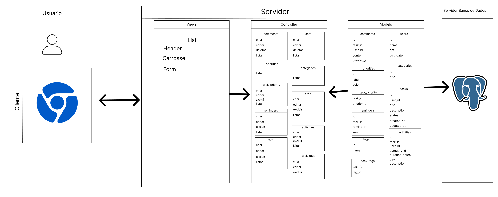

# Web Application Document - Projeto Individual - Módulo 2 - Inteli

## TASKO

#### [Antônio Augusto Tavares Ribeiro André](https://www.linkedin.com/in/antonio-augusto-tavares-ribeiro-andr%C3%A9-613937345?utm_source=share&utm_campaign=share_via&utm_content=profile&utm_medium=ios_app)

## Sumário

1. [Introdução](#c1)  
2. [Visão Geral da Aplicação Web](#c2)  
3. [Projeto Técnico da Aplicação Web](#c3)  
4. [Desenvolvimento da Aplicação Web](#c4)  
5. [Referências](#c5)  

<br>

## <a name="c1"></a>1. Introdução (Semana 01)

&emsp;TASKO é um gerenciador de tarefas projetado para proporcionar uma maneira eficiente e ágil de controlar atividades, ajudando os usuários a aumentar sua produtividade. A plataforma foi desenvolvida para otimizar a organização e execução de tarefas, permitindo que os usuários se concentrem no essencial, sem sobrecargas ou atrasos.

&emsp;Sua principal funcionalidade é a organização e detalhamento intuitivo das tarefas. Com o TASKO, o usuário pode criar listas de tarefas e destrinchá-las em subtarefas, facilitando o acompanhamento de atividades mais complexas. Além disso, a plataforma conta com uma ferramenta de priorização inteligente que organiza as tarefas de acordo com sua urgência, garantindo que o usuário sempre saiba o que deve ser feito primeiro.

---

## <a name="c2"></a>2. Visão Geral da Aplicação Web

### 2.1. Personas (Semana 01 - opcional)

*Posicione aqui sua(s) Persona(s) em forma de texto markdown com imagens, ou como imagem de template preenchido. Atualize esta seção ao longo do módulo se necessário.*

### 2.2. User Stories (Semana 01 - opcional)

*Posicione aqui a lista de User Stories levantadas para o projeto. Siga o template de User Stories e utilize a referência USXX para numeração (US01, US02, US03, ...). Indique todas as User Stories mapeadas, mesmo aquelas que não forem implementadas ao longo do projeto. Não se esqueça de explicar o INVEST de 1 User Storie prioritária.*

---

## <a name="c3"></a>3. Projeto da Aplicação Web

### 3.1. Modelagem do banco de dados  (Semana 3)

&emsp;A modelagem de banco de dados é uma etapa essencial para organização e eficiência de um sistema de armazenamento. <br>
&emsp;Apenas com uma boa prática na criação do banco de dados é que se pode ter um bom uso e execução de um sistema.

<div style ="text-align: center">

Figura 1: MER Banco de Dados


</div>

&emsp;No modelo relacional acima, é possível observar que a tabela tasks está associada a um usuário, que pode escolher uma categoria para criar sua atividade. Cada atividade possui informações sobre quem a criou, assim como o ID da tarefa associada, sendo esta uma sub-seção das atividades. Dentro das tarefas, há a opção de adicionar tags, bem como de definir um nível de prioridade, utilizando características previamente definidas.

&emsp;A partir do modelo relacional é traduzí-lo para código SQL, linguagem usada para poder realizar a aplicação.

``` sql
    CREATE TABLE users (
    id SERIAL PRIMARY KEY,
    name TEXT NOT NULL,
    cpf TEXT NOT NULL,
    birthdate DATE NOT NULL
);
```
&emsp;No exemplo acima é possível perceber o comando básico para criação de uma tabela no banco de dados com a sua entidade e seus respectivos atributos.

``` sql
CREATE TABLE categories (
    id SERIAL PRIMARY KEY,
    title TEXT NOT NULL
);

INSERT INTO categories (title) VALUES
('Estudo'),
('Exercício'),
('Trabalho'),
('Lazer');

CREATE TABLE tasks (
    id SERIAL PRIMARY KEY,
    user_id INT REFERENCES users(id) ON DELETE CASCADE,
    title TEXT NOT NULL,
    description TEXT,
    status TEXT,
    created_at TIMESTAMP DEFAULT CURRENT_TIMESTAMP
);

CREATE TABLE activities (
    id SERIAL PRIMARY KEY,
    task_id INT REFERENCES tasks(id) ON DELETE CASCADE,
    user_id INT REFERENCES users(id),
    category_id INT REFERENCES categories(id),
    duration_hours INT,
    day_activ DATE,
    description TEXT
);

CREATE TABLE comments (
    id SERIAL PRIMARY KEY,
    task_id INT REFERENCES tasks(id) ON DELETE CASCADE,
    user_id INT REFERENCES users(id),
    content TEXT,
    created_at TIMESTAMP DEFAULT CURRENT_TIMESTAMP
);

CREATE TABLE priorities (
    id SERIAL PRIMARY KEY,
    label TEXT,
    color TEXT
);

INSERT INTO priorities (label, color) VALUES 
('ALTA', '#FF0000'),
('MEDIA','#FFFF00'),
('BAIXA','#00FF00');

CREATE TABLE task_priority (
    task_id INT REFERENCES tasks(id) ON DELETE CASCADE,
    priority_id INT REFERENCES priorities(id),
);

CREATE TABLE reminders (
    id SERIAL PRIMARY KEY,
    task_id INT REFERENCES tasks(id) ON DELETE CASCADE,
    remind_at TIMESTAMP,
    sent BOOLEAN
);

CREATE TABLE tags (
    id SERIAL PRIMARY KEY,
    name TEXT
);

CREATE TABLE task_tags (
  task_id INT REFERENCES tasks(id) ON DELETE CASCADE,
  tag_id INT REFERENCES tags(id) ON DELETE CASCADE,
  PRIMARY KEY (task_id, tag_id)
);

```
&emsp;No exemplo acima, é apresentada a forma como é possível estabelecer a relação entre tabelas por meio do comando 'REFERENCES', que usa uma chave estrangeira em uma tabela e apondar para uma chave primária em outra tabela, permitindo a interação entre tabelas e realizando a lógica para as funcionalidades do gerenciador de tarefas.

### 3.1.1 BD e Models (Semana 5)
&emsp; Os Models é a principal interação do banco de dados. Ele é usado principalmente para a manipulação de dados, como a criação, edição, exclusão dos mesmos.

&emsp; Na aplicação, foram estabelecidos Models de acordo com as entidades apresentadas acima e cada um com suas respectivas características.

&emsp; Nas tabelas **comments**, **users**, **task_priority**, **tasks**, **reminders**, **tags** e **activities** é possível realizar ações de **criar** - **deletar** - **editar** - **excluir** as informações presentes nessas tabelas.

&emsp; Nas tabelas **priorities** e **categories** só foi passada a ação de **listar** as informações porque no banco de dados, as informações referentes a essas tabelas já foram previamente estabelecidas

&emsp; Já ma tabela **task_tags** é possível realizar ações de **criar** - **editar** - **excluir** mas não contém a possibilidade de listar devido à funcionalidade dessa tabela, que apenas armazena a junção das tabelas **task** e **tags**.

### 3.2. Arquitetura (Semana 5)

<div style ="text-align: center">

Figura 2: Arquitetura da aplicação


</div>

&emsp; Na imagem acima é possível observar a arquitetura da aplicação baseada no modelo MVC, onde a aplicação e dividida em 3 partes, model, view e controller.

#### Model
&emsp; O models representa a camada que vai realizar a manipulação do banco  de dados, alterando e excluindo informações das tabelas.

#### Controller
&emsp; O controller representa a camada que faz a conexão do view com o model, essa camada é responsável por receber as requisições do usuário e fazer com que isso seja executado no model e seja apresentado no view.

#### View 
&emsp; O view representa a camada de interface do usuário, nela é possível ver de maneira mais intuitiva as ações que são possíveis de serem executadas pelo model por simples interações com botões.


### 3.3. Wireframes (Semana 03 - opcional)

*Posicione aqui as imagens do wireframe construído para sua solução e, opcionalmente, o link para acesso (mantenha o link sempre público para visualização).*

### 3.4. Guia de estilos (Semana 05 - opcional)

*Descreva aqui orientações gerais para o leitor sobre como utilizar os componentes do guia de estilos de sua solução.*


### 3.5. Protótipo de alta fidelidade (Semana 05 - opcional)

*Posicione aqui algumas imagens demonstrativas de seu protótipo de alta fidelidade e o link para acesso ao protótipo completo (mantenha o link sempre público para visualização).*

### 3.6. WebAPI e endpoints (Semana 05)
# **API Documentation \- Task Management System**

## **Overview**

Esta API fornece endpoints para gerenciar um sistema completo de tarefas, incluindo usuários, tarefas, atividades, comentários, prioridades, lembretes e tags.

## **Base URL**

http://localhost:3000/api

---

## **Endpoints**

### **👥 Users (Usuários)**

#### **Criar Usuário**

* **POST** `/users`  
* **Descrição**: Cria um novo usuário no sistema  
* **Body**:

{  
  "name": "string",  
  "cpf": "string",   
  "birthdate": "date"  
}

* **Resposta de Sucesso (201)**:

{  
  "id": 1,  
  "name": "João Silva",  
  "cpf": "12345678901",  
  "birthdate": "1990-01-01"  
}

#### **Listar Usuários**

* **GET** `/users`  
* **Descrição**: Retorna todos os usuários cadastrados  
* **Resposta de Sucesso (200)**:

\[  
  {  
    "id": 1,  
    "name": "João Silva",  
    "cpf": "12345678901",  
    "birthdate": "1990-01-01"  
  }  
\]

#### **Editar Usuário**

* **PUT** `/users/:id`  
* **Descrição**: Atualiza os dados de um usuário específico  
* **Parâmetros**: `id` \- ID do usuário  
* **Body**:

{  
  "name": "string",  
  "cpf": "string",  
  "birthdate": "date"  
}

* **Resposta de Sucesso (200)**: Usuário atualizado  
* **Erro (404)**: `{ "message": "Usuario não encontrado" }`

#### **Deletar Usuário**

* **DELETE** `/users/:id`  
* **Descrição**: Remove um usuário do sistema  
* **Parâmetros**: `id` \- ID do usuário  
* **Resposta de Sucesso (200)**: Usuário deletado  
* **Erro (404)**: `{ "message": "Usuario não encontrado" }`

---

### **✅ Tasks (Tarefas)**

#### **Criar Tarefa**

* **POST** `/tasks`  
* **Descrição**: Cria uma nova tarefa  
* **Body**:

{  
  "user\_id": "number",  
  "title": "string",  
  "description": "string",  
  "status": "string"  
}

* **Resposta de Sucesso (201)**:

{  
  "id": 1,  
  "user\_id": 1,  
  "title": "Tarefa Exemplo",  
  "description": "Descrição da tarefa",  
  "status": "pendente"  
}

#### **Listar Tarefas**

* **GET** `/tasks`  
* **Descrição**: Retorna todas as tarefas cadastradas  
* **Observação**: No código atual, filtra por user\_id nos parâmetros da rota  
* **Resposta de Sucesso (200)**: Array de tarefas  
* **Erro (404)**: `{ "message": "Este usuário não tem task" }`

#### **Editar Tarefa**

* **PUT** `/tasks/:id`  
* **Descrição**: Atualiza uma tarefa específica  
* **Parâmetros**: `id` \- ID da tarefa  
* **Body**:

{  
  "title": "string",  
  "description": "string",   
  "status": "string"  
}

* **Resposta de Sucesso (200)**: Tarefa atualizada  
* **Erro (404)**: `{ "error": "Task não encontrada" }`

#### **Deletar Tarefa**

* **DELETE** `/tasks/:id`  
* **Descrição**: Remove uma tarefa do sistema  
* **Parâmetros**: `id` \- ID da tarefa  
* **Resposta de Sucesso (200)**: `{ "message": "Task excluída com sucesso" }`  
* **Erro (404)**: `{ "message": "Task não encontrada" }`

---

### **📂 Categories (Categorias)**

#### **Listar Categorias**

* **GET** `/categories`  
* **Descrição**: Retorna todas as categorias disponíveis  
* **Resposta de Sucesso (200)**:

\[  
  {  
    "id": 1,  
    "name": "Categoria Exemplo"  
  }  
\]

---

### **🎯 Activities (Atividades)**

#### **Criar Atividade**

* **POST** `/tasks/:task_id/activities`  
* **Descrição**: Cria uma nova atividade dentro de uma tarefa  
* **Parâmetros**: `task_id` \- ID da tarefa  
* **Body**:

{  
  "task\_id": "number",  
  "user\_id": "number",  
  "category\_id": "number",  
  "duration\_hours": "number",  
  "day\_activ": "date"  
}

* **Resposta de Sucesso (201)**: Atividade criada

#### **Listar Atividades**

* **GET** `/tasks/:task_id/activities`  
* **Descrição**: Retorna todas as atividades de uma tarefa  
* **Parâmetros**: `task_id` \- ID da tarefa (usado como user\_id na query)  
* **Resposta de Sucesso (200)**: Array de atividades  
* **Erro (404)**: `{ "message": "Este usuário não tem atividades" }`

#### **Editar Atividade**

* **PUT** `/tasks/:task_id/activities/:id`  
* **Descrição**: Atualiza uma atividade específica  
* **Parâmetros**:  
  * `task_id` \- ID da tarefa  
  * `id` \- ID da atividade  
* **Body**:

{  
  "task\_id": "number",  
  "category\_id": "number",  
  "duration\_hours": "number",  
  "day\_activ": "date"  
}

* **Resposta de Sucesso (200)**: Atividade atualizada  
* **Erro (404)**: `{ "message": "Atividade não encontrada" }`

#### **Deletar Atividade**

* **DELETE** `/tasks/:task_id/activities/:id`  
* **Descrição**: Remove uma atividade  
* **Parâmetros**:  
  * `task_id` \- ID da tarefa  
  * `id` \- ID da atividade  
* **Resposta de Sucesso (200)**: Atividade deletada  
* **Erro (404)**: `{ "message": "Atividade não encontrado" }`

---

### **💬 Comments (Comentários)**

#### **Criar Comentário**

* **POST** `/tasks/:task_id/comments`  
* **Descrição**: Adiciona um comentário a uma tarefa  
* **Parâmetros**: `task_id` \- ID da tarefa  
* **Body**:

{  
  "task\_id": "number",  
  "user\_id": "number",  
  "content": "string"  
}

* **Resposta de Sucesso (201)**: Comentário criado

#### **Listar Comentários**

* **GET** `/tasks/:task_id/comments`  
* **Descrição**: Retorna todos os comentários de uma tarefa  
* **Parâmetros**: `task_id` \- ID da tarefa  
* **Resposta de Sucesso (200)**: Array de comentários  
* **Erro (404)**: `{ "message": "Esta task não tem comentários" }`

#### **Editar Comentário**

* **PUT** `/tasks/:task_id/comments/:id`  
* **Descrição**: Atualiza um comentário específico  
* **Parâmetros**:  
  * `task_id` \- ID da tarefa  
  * `id` \- ID do comentário  
* **Body**:

{  
  "task\_id": "number",  
  "content": "string"  
}

* **Resposta de Sucesso (200)**: Comentário atualizado  
* **Erro (404)**: `{ "error": "Comentario não encontrada" }`

#### **Deletar Comentário**

* **DELETE** `/tasks/:task_id/comments/:id`  
* **Descrição**: Remove um comentário  
* **Parâmetros**:  
  * `task_id` \- ID da tarefa  
  * `id` \- ID do comentário  
* **Resposta de Sucesso (200)**: `{ "message": "Comentario excluído com sucesso" }`  
* **Erro (404)**: `{ "message": "Comentario não encontrado" }`

---

### **⚡ Priorities (Prioridades)**

#### **Listar Prioridades**

* **GET** `/priorities`  
* **Descrição**: Retorna todas as prioridades disponíveis  
* **Resposta de Sucesso (200)**:

\[  
  {  
    "id": 1,  
    "label": "ALTA"
    "color": "#FF0000
  },  
  {  
    "id": 2,  
    "label": "MEDIA" 
    "color": "#FFFF00" 
  },  
  {  
    "id": 3,  
    "label": "BAIXA" 
    "color": "#00FF00" 
  }  
\]

---

### **🎯 Task Priority (Prioridade de Tarefas)**

#### **Criar Prioridade da Tarefa**

* **POST** `/tasks/:task_id/priority`  
* **Descrição**: Define a prioridade de uma tarefa  
* **Parâmetros**: `task_id` \- ID da tarefa  
* **Body**:

{  
  "task\_id": "number",  
  "priority\_id": "number"  
}

* **Resposta de Sucesso (201)**: Prioridade atribuída

#### **Listar Tarefas por Prioridade**

* **GET** `/tasks/:task_id/priority`  
* **Descrição**: Retorna todas as tarefas ordenadas por prioridade (ALTA, MEDIA, BAIXA)  
* **Parâmetros**: `task_id` \- ID da tarefa  
* **Resposta de Sucesso (200)**:

\[  
  {  
    "id": 1,  
    "title": "Tarefa Urgente",  
    "description": "Descrição",  
    "status": "pendente",  
    "priority\_label": "ALTA"  
  }  
\]

#### **Editar Prioridade da Tarefa**

* **PUT** `/tasks/:task_id/priority/:id`  
* **Descrição**: Atualiza a prioridade de uma tarefa  
* **Parâmetros**:  
  * `task_id` \- ID da tarefa  
  * `id` \- ID da prioridade  
* **Body**:

{  
  "priority\_id": "number"  
}

* **Resposta de Sucesso (200)**: Prioridade atualizada

#### **Deletar Prioridade da Tarefa**

* **DELETE** `/tasks/:task_id/priority/:id`  
* **Descrição**: Remove a prioridade de uma tarefa  
* **Parâmetros**:  
  * `task_id` \- ID da tarefa  
  * `id` \- ID da prioridade  
* **Resposta de Sucesso (200)**: `{ "message": "Prioridade excuida" }`  
* **Erro (404)**: `{ "message": "Prioridade não encontrada" }`

---

### **⏰ Reminders (Lembretes)**

#### **Criar Lembrete**

* **POST** `/tasks/:task_id/reminders`  
* **Descrição**: Cria um lembrete para uma tarefa  
* **Parâmetros**: `task_id` \- ID da tarefa  
* **Body**:

{  
  "task\_id": "number",  
  "remind\_at": "datetime",  
  "sent": "boolean"  
}

* **Resposta de Sucesso (201)**: Lembrete criado

#### **Listar Lembretes**

* **GET** `/tasks/:task_id/reminders`  
* **Descrição**: Retorna todos os lembretes de uma tarefa  
* **Parâmetros**: `task_id` \- ID da tarefa  
* **Resposta de Sucesso (200)**: Array de lembretes

#### **Editar Lembrete**

* **PUT** `/tasks/:task_id/reminders/:id`  
* **Descrição**: Atualiza um lembrete específico  
* **Parâmetros**:  
  * `task_id` \- ID da tarefa  
  * `id` \- ID do lembrete  
* **Body**:

{  
  "remind\_at": "datetime"  
}

* **Resposta de Sucesso (200)**: Lembrete atualizado

#### **Deletar Lembrete**

* **DELETE** `/tasks/:task_id/reminders/:id`  
* **Descrição**: Remove um lembrete  
* **Parâmetros**:  
  * `task_id` \- ID da tarefa  
  * `id` \- ID do lembrete  
* **Resposta de Sucesso (200)**: `{ "message": "Lembrete excluído" }`  
* **Erro (404)**: `{ "message": "Lembrete não encontrado" }`

---

### **🏷️ Tags**

#### **Criar Tag**

* **POST** `/tasks/:task_id/tags`  
* **Descrição**: Cria uma nova tag  
* **Parâmetros**: `task_id` \- ID da tarefa  
* **Body**:

{  
  "name": "string"  
}

* **Resposta de Sucesso (201)**: Tag criada

#### **Listar Tags**

* **GET** `/tasks/:task_id/tags`  
* **Descrição**: Retorna todas as tags disponíveis  
* **Parâmetros**: `task_id` \- ID da tarefa  
* **Resposta de Sucesso (200)**: Array de todas as tags

#### **Editar Tag**

* **PUT** `/tasks/:task_id/tags/:id`  
* **Descrição**: Atualiza uma tag específica  
* **Parâmetros**:  
  * `task_id` \- ID da tarefa  
  * `id` \- ID da tag  
* **Body**:

{  
  "name": "string"  
}

* **Resposta de Sucesso (200)**: Tag atualizada  
* **Erro (404)**: `{ "message": "Tag não encontrada" }`

#### **Deletar Tag**

* **DELETE** `/tasks/:task_id/tags/:id`  
* **Descrição**: Remove uma tag  
* **Parâmetros**:  
  * `task_id` \- ID da tarefa  
  * `id` \- ID da tag  
* **Resposta de Sucesso (200)**: Tag deletada  
* **Erro (404)**: `{ "message": "Tag não encontrada" }`

---

### **🔗 Task Tags (Relacionamento Tarefa-Tag)**

#### **Criar Relacionamento Tarefa-Tag**

* **POST** `/tags/task_tags`  
* **Descrição**: Cria uma associação entre tarefa e tag  
* **Body**:

{  
  "task\_id": "number",  
  "tag\_id": "number"  
}

* **Resposta de Sucesso (201)**: Relacionamento criado

#### **Editar Relacionamento Tarefa-Tag**

* **PUT** `/tags/task_tags/:id`  
* **Descrição**: Atualiza um relacionamento específico  
* **Parâmetros**: `id` \- ID do relacionamento  
* **Body**:

{  
  "tag\_id": "number"  
}

* **Resposta de Sucesso (200)**: Relacionamento atualizado

#### **Deletar Relacionamento Tarefa-Tag**

* **DELETE** `/tags/task_tags`  
* **Descrição**: Remove a associação entre tarefa e tag  
* **Body**:

{  
  "task\_id": "number"  
}

* **Resposta de Sucesso (200)**: `{ "message": "Tag excluída" }`

---

## **Códigos de Status HTTP**

* **200 OK**: Requisição executada com sucesso  
* **201 Created**: Recurso criado com sucesso  
* **400 Bad Request**: Dados inválidos na requisição  
* **404 Not Found**: Recurso não encontrado  
* **500 Internal Server Error**: Erro interno do servidor

## **Estrutura de Resposta**

### **Sucesso**

{  
  "id": 1,  
  "campo": "valor",  
  "created\_at": "2024-01-01T10:00:00Z"  
}

### **Erro**

{  
  "error": "Mensagem de erro detalhada"  
}


### 3.7 Interface e Navegação (Semana 07)

*Descreva e ilustre aqui o desenvolvimento do frontend do sistema web, explicando brevemente o que foi entregue em termos de código e sistema. Utilize prints de tela para ilustrar.*

---

## <a name="c4"></a>4. Desenvolvimento da Aplicação Web (Semana 8)

### 4.1 Demonstração do Sistema Web (Semana 8)

*VIDEO: Insira o link do vídeo demonstrativo nesta seção*
*Descreva e ilustre aqui o desenvolvimento do sistema web completo, explicando brevemente o que foi entregue em termos de código e sistema. Utilize prints de tela para ilustrar.*

### 4.2 Conclusões e Trabalhos Futuros (Semana 8)

*Indique pontos fortes e pontos a melhorar de maneira geral.*
*Relacione também quaisquer outras ideias que você tenha para melhorias futuras.*


## <a name="c5"></a>5. Referências

_Incluir as principais referências de seu projeto, para que o leitor possa consultar caso ele se interessar em aprofundar._<br>

---
---
